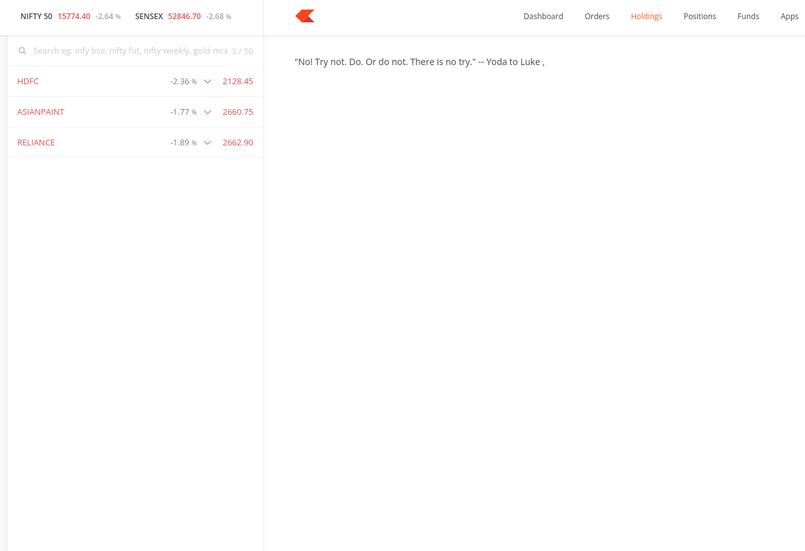

# kite-yoda

_Ignorance is bliss._

## What

It's a browser extension/userscript to replace the "Holdings" section on https://kite.zerodha.com and replace it with a random Yoda quote.

## Why

It's for personal use. I don't want to look at my portfolio during _bear markets_ but somehow end up logging in to Kite. It's similar to how one opens the fridge multiple times, expecting something new even though one is aware of the contents inside it.

Hopefully, this small piece of code will help me make fewer stupid decisions. YMMV.

## Install

In the 0.0001% case that you also wanna use, you can use the following methods:

### Userscript (Preferred)

You can use Greasemonkey or Tampermonkey in your browser and install [this user script](https://raw.githubusercontent.com/mr-karan/kite-yoda/main/user_script.js).

### Extension

you can download the [zip](./artifacts/kite_yoda-1.0.zip) and [load](https://extensionworkshop.com/documentation/develop/temporary-installation-in-firefox/) in your browser. I don't have the bandwidth for publishing this and going through the review process for something I won't use after some time.
